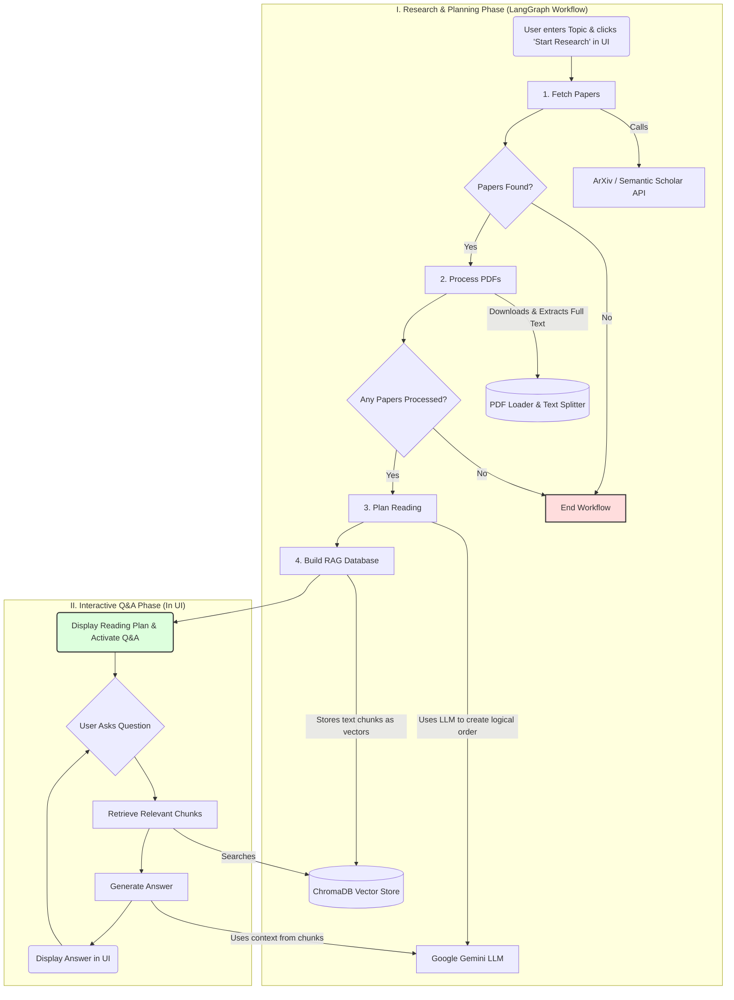

# AI Research Assistant Agent

An intelligent agent that automates the academic research workflow. Give it a topic, and it finds, reads, and prioritizes relevant papers, then builds a knowledge base you can chat with.

## Overview

Starting research on a new academic topic can be overwhelming. This project tackles that problem by providing an AI agent that automates the entire process. It uses Large Language Models and a stateful workflow to transform a simple topic query into a structured, queryable library of academic papers.

[cite_start]This project was built to fulfill the requirements of the CS180 Project Proposal[cite: 1].

## Features

* **Multi-Source Paper Retrieval**: Fetches academic papers from both **ArXiv** and **Semantic Scholar** based on a user's query.
* **Full-Text PDF Processing**: Instead of just using abstracts, the agent downloads and extracts the **full text** from each paper's PDF for deep analysis and accurate answers.
* **LLM-Powered Reading Plan**: Uses the **Google Gemini LLM** to analyze all processed papers and generate a logical reading plan, ordering papers from foundational to advanced.
* **Stateful Agentic Workflow**: The core backend is built with **LangGraph**, orchestrating the entire process—fetching, processing, and planning—as a robust, stateful graph. This ensures the workflow is reliable and can handle steps where no papers are found or processed.
* **Interactive RAG Q&A**: Builds a vector knowledge base using **ChromaDB**. It then allows you to ask specific questions and get answers grounded directly in the content of the source documents using a Retrieval-Augmented Generation (RAG) pipeline.
* **Simple Web UI**: An interactive user interface built with **Streamlit** allows for easy interaction with the agent without needing to use the command line.

## Architecture & Workflow

The project's workflow is managed by a LangGraph state machine. This graph ensures that each step is executed in the correct order and that the state (like the list of papers and processed text) is passed between them reliably.



## Tech Stack

* **Orchestration**: LangGraph
* **LLM & Embeddings**: Google Gemini
* **Vector Database**: ChromaDB
* **UI**: Streamlit
* **Core Libraries**: LangChain, Pydantic, Requests

## Setup and Installation

Follow these steps to set up the project locally.

1.  **Clone the repository:**
    ```bash
    git clone [https://github.com/vismayabanand/ai-research-assistant-agent.git](https://github.com/vismayabanand/ai-research-assistant-agent.git)
    cd ai-research-assistant-agent
    ```

2.  **Create a virtual environment and activate it:**
    ```bash
    python3 -m venv .venv
    source .venv/bin/activate
    ```

3.  **Install the project in editable mode:**
    (This command uses the `pyproject.toml` file to install all required dependencies.)
    ```bash
    pip install -e .
    ```

4.  **Set up your environment variables:**
    Create a file named `.env` in the root of the project and add your Google API key.
    ```env
    # .env
    GOOGLE_API_KEY="YOUR_GOOGLE_API_KEY_HERE"
    ```

## How to Run

1.  Ensure your virtual environment is activated.
2.  Run the Streamlit application from the project root directory:
    ```bash
    streamlit run ui.py
    ```
3.  A new tab should open in your browser with the application running.
